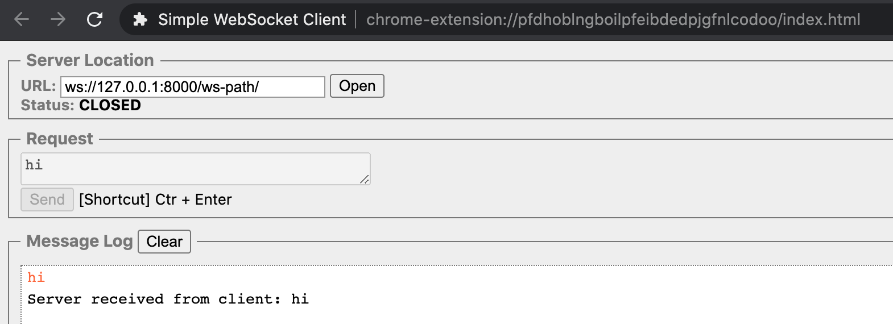

# intro
透過kong實作nginx反向代理

`kong`基於`openresty`所開發的一個開源專案，透過`konga`介面來操作動態路由

# 使用kong api設定路由導向

```bash
curl -XPOST localhost:8001/services --data name=grpc --data protocol=grpc --data host=localhost --data port=50051
```

# 透過konga來設定路由導向
### 登入konga網址並且註冊
1. 進入網頁: http://127.0.0.1:1337
2. 設定對應的username/e-mail/password/confirm-password
3. 登入帳號


### 設定konga對於kong的連線
1. 點選`CONNECTION` > `+ NEW CONNECTION`
2. 設定連線資訊`Name: kona`，`Kong Admin URL: http://kong:8001`
3. 點選`UPDATE CONNECTION` > `Taggle active`
```
此時頁面的左方應該會額外跳出API GATEWAY及對應的
INFO、SERVICES、ROUTES、CONSUMERS、PLUGINS、UPSTREAMS、CERTIFICATES
等選項
```

### (http)設定service及service對應的orign
1. 點選`SERVICES` > `+ ADD NEW SERVICE`
2. 輸入資訊`Name: web1`、`Url: http://web1`
3. 點選剛剛新增好的`web1`
```
此時頁面會出現
Service Details、Routes、Plugins
等選項
```
4. 選擇`Routes` > `+ ADD ROUTE`
5. 輸入資訊`Name: web1-router`、`Paths: /http-path(*)`、`Methods: GET(*)` > `SUBMIT ROUTE`
(*這邊輸入完GET要按"enter"才會生效)
6. 進入網頁: http://127.0.0.1:8000/http-path


### (ws)設定service的router
1. 點選`SERVICES` > `+ ADD NEW SERVICE`
2. 輸入資訊`Name: ws`、`Url: http://ws:8010`
3. 點選剛剛新增好的`ws`
```
此時頁面會出現
Service Details、Routes、Plugins
等選項
```
4. 選擇`Routes` > `+ ADD ROUTE`
5. 輸入資訊`Name: ws-router`、`Paths: /ws-path(*)`、`Methods: GET(*)` > `SUBMIT ROUTE`
(*這邊輸入完GET要按"enter"才會生效)
6. 下載chrome的ws-client插件，輸入`ws://127.0.0.1:8000/ws-path/`後點選open可以連線，並且發送訊息



# konga & kong 更新版本，不再使用舊有的設定 ----------- deprecate ----------
# 使用docker部署kong api-gateway
1. 安裝postgres
```shell
docker run -d --name kong-database \
                -p 5432:5432 \
                -e "POSTGRES_USER=kong" \
                -e "POSTGRES_DB=kong" \
                postgres
```

2. 把kong所需要的資料migrate到postgres
```shell
docker run --rm \
    --link kong-database:kong-database \
    -e "KONG_DATABASE=postgres" \
    -e "KONG_PG_HOST=kong-database" \
    -e "KONG_CASSANDRA_CONTACT_POINTS=kong-database" \
    kong kong migrations up
```

3. 啟動kong
```shell
docker run -d --name kong \
--link kong-database:kong-database \
-e "KONG_DATABASE=postgres" \
-e "KONG_PG_HOST=kong-database" \
-e "KONG_PROXY_ACCESS_LOG=/dev/stdout" \
-e "KONG_ADMIN_ACCESS_LOG=/dev/stdout" \
-e "KONG_PROXY_ERROR_LOG=/dev/stderr" \
-e "KONG_ADMIN_ERROR_LOG=/dev/stderr" \
-e "KONG_ADMIN_LISTEN=0.0.0.0:8001" \
-e "KONG_ADMIN_LISTEN_SSL=0.0.0.0:8444" \
-p 8000:8000 \
-p 8443:8443 \
-p 8001:8001 \
-p 8444:8444 \
kong
```
# 為kong增加api-service
1. 檢查kong是否已經正常執行，順便確認目前現有的api
```shell
curl -i localhost:8001/apis
```
2. 替kong增加一個rest api
> 在此假設curl -i http://104.155.197.92:899/dbpractice/ 是會回應對應response的
```shell
curl -i -X POST \
  --url  http://localhost:8001/apis/ \
  --data 'name=django-api' \
  --data 'uris=/dbpractice' \
  --data 'strip_uri=false' \
  --data 'upstream_url=http://104.155.197.92:8999'
```
- url : 在kong上註冊api需要使用8001 port，並且給end point 'apis'
- name : 定義在kong上註冊的api名稱，不會影響呼叫api的功能。用來作為讓kong識別檢查既有或是刪除用
- uris : 定義upstream_url後可以使用的end point
- strip_uri : 選擇false，表示後面的end point都可以被呼叫。例如/dbpractice/dbpost, /dbpractice/dbdrop
- upstream_url : 定義kong要轉接的api來源url; 表示curl -i http://104.155.197.92:8999/dbpractice/ ...是有回傳值得！

3. 呼叫一個已經在kong上被註冊過的api
```shell
curl -i localhost:8000/dbpractice/dbpost
```
- 在此處，kong預設8000 port作為代理port。

4. 刪除kong上的一個rese api
```shell
curl -i localhost:8001/api/django-api
```

# 使用konga註冊api
1. 使用docker-compose up -d 等待程式跑完訪問localhost:1337
2. 使用預設user/password登入:admin/adminadminadmin
3. 點選connections裡面，連接的星星確認有連線到kong成功的話會在API_GATEWAY跳出一些設定upstream的項目
4. 點選api，使用預設的web1作為測試。在Upstream URL填入'http://web1'；Uris填入'/'；name可以隨便取一個。之後按SUBMIT CHANGES
5. 開啟瀏覽器，填入localhost:8000/，會訪問到預設頁面index.html


# refer
1. https://docs.konghq.com/
2. https://docs.konghq.com/0.14.x/proxy/
3. https://www.cnblogs.com/zhoujie/p/kong2.html

### extend-refer(while kong above 1.0.0)
4. https://hub.docker.com/r/pantsel/konga/tags
5. https://github.com/pantsel/konga
6. https://github.com/pantsel/konga/blob/master/docker-compose.yml
7. https://medium.com/@tselentispanagis/managing-microservices-and-apis-with-kong-and-konga-7d14568bb59d
8. https://juejin.im/post/6844904056628969486