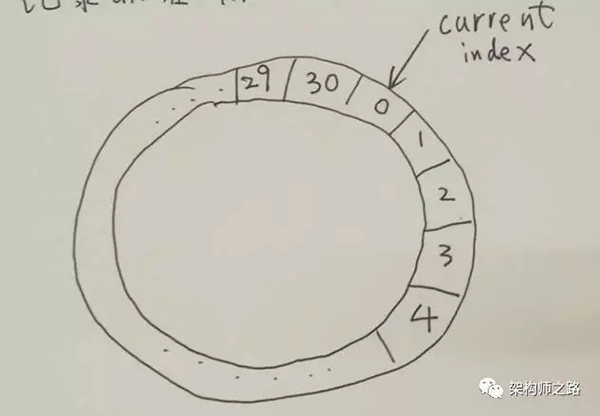

# 動機
很多時候，業務有定時任務或者定時超時的需求，當任務量很大時，可能需要維護大量的 timer，或者進行低效的掃瞄

例如:
```
58到家App實現消息溝通系統，對每個用戶會維護一個 "App到服務器的TCP連接" ，用來實時收發消息
對這個TCP連接，有這樣一個需求: "如果連續 30s 沒有請求包(例如: 登入，消息，keepalive包)，服務就要將至個用戶的狀態置為離線"
其中單機TCP 同時在線量約在 10w 級別，keepalive請求包大概 30s 一次，吞吐量約在 3000 qps
```

> 一般來說如何實現這類需求呢?

## 1. 輪詢掃瞄法
1. 用一個 Map
2. 當某個用戶 Uid 有請求包來到，實時更新這個 Map
3. 啟動一個 timer，當 Map 中不為空時，輪詢掃描這個 Map，看每個 Uid 的 last_packet_time 是否超過 30s，如果超過則進行超時處理

## 2. 多 timer 觸發法
1. 用一個 Map
2. 當某個用戶 Uid 有請求包來到，實時更新這個 Map，並同時對這個 Uid 請求包啟動一個 timer，30s 之後觸發
3. 每個 Uid 請求包對應的 timer 觸發後，看 Map 中，查看這個 Uid 的 last_packet_timer 是否超過 30s，如果超過則進行超時處理
	- 方案一: 只啟動一個 timer，但需要輪詢，效率較低
	- 方案二: 不需要輪詢，但每個請求包要啟動一個 timer，比較耗資源

特別在同時在線量很大時，很容易 CPU100%

# 如何高效維護和觸發大量的 定時/超時任務 ?
- 環形隊列法:
1. 30s 超時，創建一個 index 從 0 到 30 的環形隊列(本質是個數組)
2. 環上每一個 slot 是一個 Set，任務集合
3. 同時還有一個 Map

同時:
1. 啟動一個 timer，每隔 1s，在上述環形隊列中移動一格，0->1->2->3...->29->30->0
2. 有一個 Current Index 指針來標示剛檢測過的 slot

## 當有某個用戶 Uid 有請求包到達時:
1. 從 Map 結構中，查找出這個 Uid 儲存在哪一個 slot 裏
2. 從這個 slot 的 Set 結構中，刪除這個 Uid
3. 將 Uid 重新加入到新的 slot 中，具體是哪一個 slot 呢 => Current Index 指針所指向的上一個 slot，因為這個 slot，會被 timer 在 30s 之後掃到
4. 更新 Map，這個 Uid 對應 Slot 的 Index 值

## 哪些元素會被超時掉呢?
Current Index 每秒移動一個 slot，這個 slot 對應的 Set 中所有 Uid 都應該被集體超時!
如果最近 30s 有請求包來到，一定被放到 Current Index 的前一個 slot 了
Current Index 所在的 slot 對應 Set 中所有元素，都是最近 30s 沒有請求包來到的
所以，當沒有超時的情況下，Current Index 掃到的每一個 slot 的 Set 中應該都沒有元素。

## 優勢
1. 只需要一個 timer
2. timer 每 1s 只需要一次觸發，消耗 CPU 很低
3. 批量超時，Current Index 掃到的 slot，Set 中所有元素都應該被超時掉

# 總結
這個環形隊列是一個通用的方法，Set 和 Map 中可以是任何 Task，本文中的 Uid 就是一個最簡單的舉例
