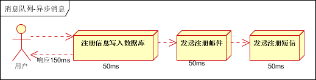
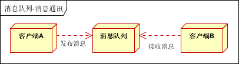

# 消息隊列概述
1. 消息隊列中間件，是分布式系統中最重要的組件
2. 主要解決應用解耦，異步消息，流量緩衝等問題
3. 實現高性能，高可用，可申雖和最終一致性的架構

# 消息隊列應用場景
1. 異步處理
2. 應用解耦
3. 緩衝流量

## 1. 異步處理
場景說明: 用戶註冊後，需要發送註冊郵件和註冊短信。

- [傳統作法] 串行
> 將註冊信息寫入數據庫成功後，發送註冊郵件，在發送註冊短信。以上步驟完成後返回給客戶端

- [傳統作法] 並行
> 將註冊信息寫入數據庫成功後，發送註冊郵件的同時，發送註冊短信。以上三個人物完成後，返回給客戶端
<!-- 與串行的差別是，必行的方式可以提高處理的效率，降低整體處理時間 -->

- 假設三個業務節點個別使用 50 毫秒，不考慮網路等其他開銷
1. 串行方式耗時 150 毫秒，並行方式耗時 100 豪秒
2. 因為 CPU 在單位時間內處理的請求數是一定的，假設 CPU 每秒能處理的吞吐量是 1000 次
	- 串行方式，CPU每秒能處理的請求量是 7 次; 1000/150
	- 並行方式，CPU每秒能處理的請求量是 10 次; 1000/100

- [引入MQ]
> 考慮使用 MQ 做異步處理，當註冊信息在 MQ 落地後則返回給客戶端，可以將總處理費時降到 55 毫秒，CPU每秒處理提升至 18 次; 1000/55

## 2. 應用解耦
業務場景: 用戶下單後，訂單系統需要通知庫存系統

- [傳統作法] 訂單系統調用庫存系統接口

> 缺點: 假如庫存系統無法訪問，則訂單減庫存將失敗，從而導致訂單失敗

- [引用MQ] MQ 解耦

1. 訂單系統: 用戶下單後，訂單系統完成持久化處理，將消息寫入 MQ，返回訂單下單成功
2. 庫存系統: 訂閱下單的消息，採用 拉/推 的方式，獲取下單信息，庫存系統根據下單信息，進入庫存操作
<!-- 假如: 在下單時`庫存系統`不能正常使用，也不影響正常下單，因為下單後，訂單系統寫入 MQ 就不再關心其他的後續操作了 -->

## 3. 緩衝流量
<!-- 緩衝流量是 MQ 應用場景中最常見的，一般在秒殺或團搶活動中使用 -->
應用場景: 秒殺活動，一般會因為瞬間流量過大，導致流量暴增，應用掛掉。一般需要再應用前端加入消息隊列
- 可以控制活動的人數
- 可以緩解短時間內高流量壓垮應用

> 服務器接到用戶的請求後，首先寫入 MQ，假如 MQ 長度超過最大數量，則直接拋棄用戶請求，或跳轉至錯誤頁面
<!-- 秒殺業務根據 MQ 中的請求信息，在做後續處理 -->

## (補) 日誌處理
應用場景: 將 MQ 應用在日誌處理中，比如 Kafka 的應用，解決大量日誌傳輸的問題

1. 日誌採集客戶端: 負責日誌數據採集，定時寫至 Kafka
2. Kafka消息隊列: 負責日誌數據的接收，儲存和轉發
3. 日誌處理應用端: 訂閱並消費 Kafka 隊列中的日誌數據

## (補) 即時通訊
應用場景: MQ 一般都內建了高效的通信機制，因此也可以用在純的消息通訊。比如實現點對點消息隊列，或者聊天室等
- 點對點通訊:

> 客戶端 A 和 客戶端 B 使用同一隊列，進行消息通訊

- 聊天室通訊:

> 客戶端 A，客戶端 B，客戶端 N 訂閱同一主題，進行消息發佈和接收，實現類似聊天室效果

# [範例] MQ in 電商系統
- 電商系統

1. 應用將主要邏輯處理完成後，寫入 MQ，MQ 反饋是否可以成功落地的狀態。(MQ 返回消息接收成功狀態後，應用在返回給客戶端)
2. 擴展流程(發短信，配送處理)訂閱 MQ 消息。採用 推/拉 留的方式獲取消息並處理
3. MQ 應用於解耦時，也帶來數據的一致性問題。採用"最終一致性方式解決“

- 日誌收集系統

1. Zookeeper 為註冊中心: 提供負載均衡和地址查找服務
2. 日誌收集客戶端: 用於採集應用系統的日誌，並將數據推送到 Kafka
3. Kafka 集群: 接收、路由、儲存及轉發消息
4. Storm 集群: 應用層，採用拉的方式消費 Kafka 隊列中的數據

# MQ 選型對比

