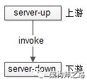
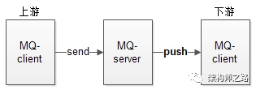
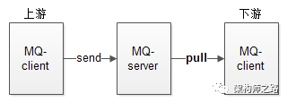

# 什麼時候要用 MQ
MQ 有一個最典型的應用場景，緩衝流量。

- 一般網站與服務上下游之間的通訊
1. `直接調用`，通過 RPC 框架，上游直接調用下游

2. 採用`MQ推送`，上游發送消息給 MQ，MQ 將消息推送給下游

## 為什麼會有流量衝擊 
不管採用 `直接調用` 還是 `MQ推送` 都有共同的缺點，下游消息接收方無法控制到達自己的流量，如果調用方不限速。下游可能被壓垮

- 舉個例子，秒殺業務:
1. 上游發起下單操作
2. 下游完成秒殺業務邏輯
	- 庫存檢查
	- 庫存凍結
	- 餘額檢查
	- 訂單生成
	- 餘額扣減
	- 生成流水
	- 餘額解凍
	- 庫存解凍

上游下單業務簡單，每秒可以達到 10000 個請求，下游業務複雜，每秒只能處理 2000 個請求
很有可能上游不限速的下單，導致下游系統被壓垮。引發雪崩

- 為了避免雪崩，常見的優化方案有兩種:
1. 業務上游隊列緩衝，限速發送
2. 業務下游隊列緩衝，限速執行

不管哪種方案，都會引入業務的複雜性，有"緩衝流量"需求的系統都需要加入類似的機制

## 如何緩衝流量
透過 MQ，並且 MQ 實現消息落地機制，利用 MQ 當緩衝層

## MQ 緩衝流程
- 由 MQ-producer 推模式，配合 MQ-consumer 拉模式

MQ-client 依據自己的處理能力，每隔一定時間，或者每次拉取若干條消息，實施`流控`，達到保護自身的效果
<!-- 此為基於 MQ 提供的通用功能，無需修改上下游的代碼 -->

## 如果上游發送量過大，MQ提供拉模式是否會導致消息在MQ中堆積?
優化，水平潰散下游 MQ-client，讓消息接收方能夠批量獲取消息，批量寫操作，提升整體吞吐量

# 總結
1. MQ-client 提供拉模式，定時或者批量拉取，可以起到削平流量，下游自我保護的作用(MQ需要做的)
2. 要想提升整體吞吐量，需要優化下游服務，提供批量處理能力
