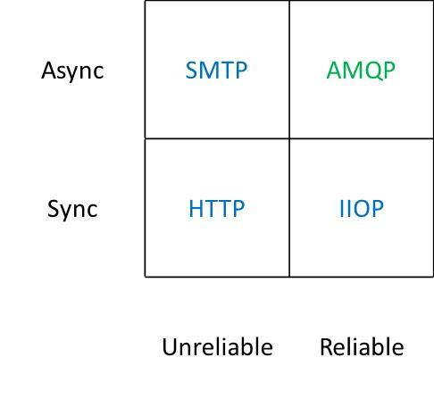
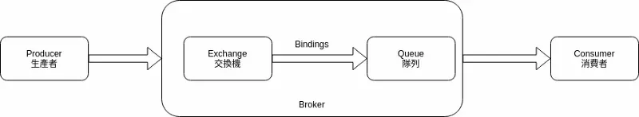
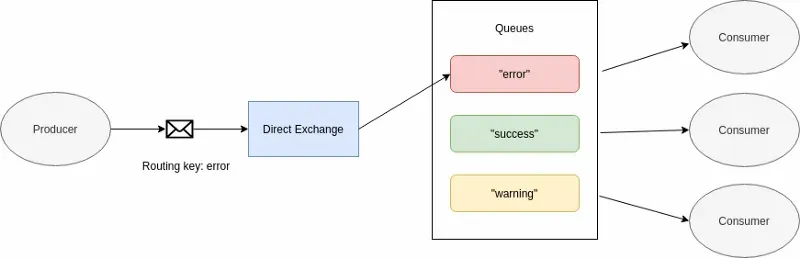
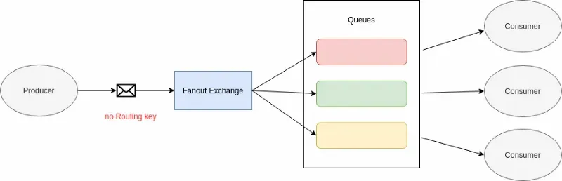
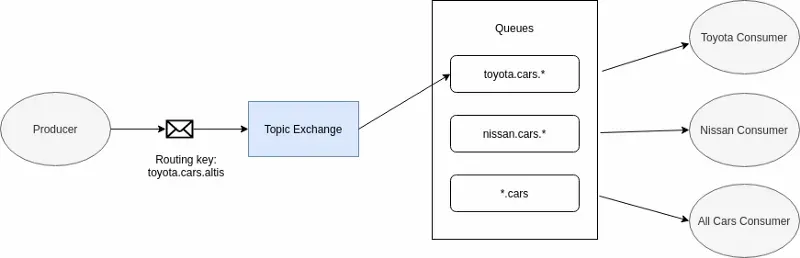
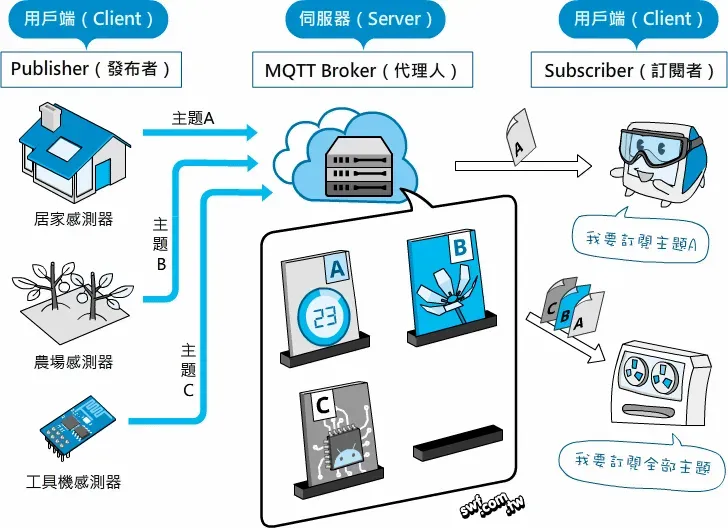
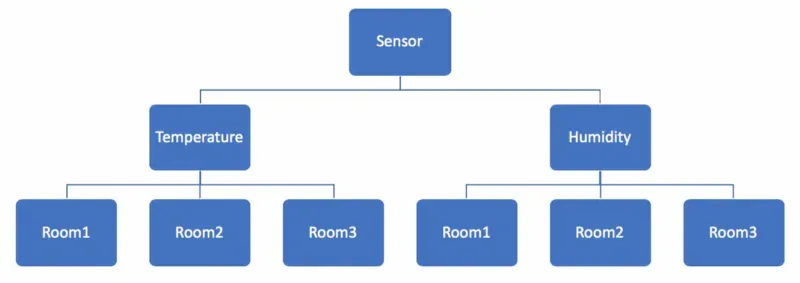

# 動機
如果今天業務場景是需要`保證傳達(Reliable)`且允許`非同步(Async)`的訊息傳達和交換方式，這時候就需要 MQ，而首選就是 AMQP



# AMQP, Advanced Message Queuing Protocol(高級訊息佇列協議)


- Produce: 生產者，負責生產訊息並送到交換機
- Broker: Message Queue 的服務器(RabbitMQ ... 之類惡產品)
- Exchange: 交換器，指定訊息按照什麼樣的規則送到哪個 Queue
- Binding: 綁定規則，後面會介紹幾種常用的 MQ 模式
- Queue: 消息隊列，後面會介紹幾種常用的 MQ 模式
- Consumer: 消費者，負責接受與處理訊息

# 特點
- 金融業發展出來用於交易所訊息交換的協定
- 發布者、交換機、隊列、消費者都可以有多個。因為AMQP是一種網路協議，所以過程中的發布者、消費者、代理都能分佈在不同的設備上
- 發布消息時可以帶上消息屬性(Message Meta)，有些屬性可以被消息代理(Brokers)使用，有些則為不透明的，只能被消費者使用
- 由於必須假設網路是不可靠的，因此可能某個消費者處理訊息的過程中可能掛掉，基於此原因AMQP協議就包含了消息確認(Message Acknowledgements)機制，確保收到來自消費者的訊息後才將該筆訊息從Queue中刪除。

# AMQP 協議中的幾個重要概念
## ConnectionFactory Connection Channel
ConnectionFactory、Connection、Channel 都是 RabbitMQ 對外提供的 API 中最基本的物件

- ConnectionFactory: ConnectionFactory為Connection的製造工廠。
- Connection: Connection是RabbitMQ的socket連結，它封裝了socket協議相關部分邏輯。
- Channel(通道): 通道是建立在`真實的`TCP連線上的虛擬連線，在一條TCP連結上建立多少條通道是沒有限制的
<!-- 
把他想象成光纖就是可以了。它是我們與RabbitMQ打交道的最重要的一個介面
我們大部分的業務操作是在Channel這個介面中完成的
包括定義Queue、定義Exchange、繫結Queue與Exchange、釋出訊息等
-->

## Queue(佇列)
Queue 是 MQ 的內部物件，用於儲存訊息。

## Message Acknowledgment(ack訊息的確認)
在實際應用中，可能會發生消費者收到Queue中的訊息，但沒有處理完成就宕機(或出現其他意外)的情況，這種情況下就可能會導致訊息丟失

為了避免這種情況發生，我們可以要求消費者在消費完訊息後傳送一個回應給 MQ，MQ 收到訊息回應(ack)後才將該訊息從Queue中移除;

如果 MQ 沒有收到回應並檢測到 consumer 的 MQ 連線斷開，則 MQ 會將該訊息傳送給其他 consumer(如果存在多個 consumer)進行處理

這裡不存在timeout概念，一個 consumer 處理訊息時間再長也不會導致該訊息被送給其他消費者，除非 MQ 連線斷開

這裡會產生另外一個問題，如果人員在處理完業務邏輯後，忘記傳送回應給 MQ，這將會導致嚴重的bug——Queue中堆積的訊息會越來越多；

consumer 重啟後會`重複消費`這些訊息並重復執行業務邏輯…

另外pub message是沒有ack的

## Message durability(訊息的持久化)
如果我們希望即使在 MQ 服務重啟的情況下，也不會丟失訊息，我們可以將 Queue 與 Message 都設定為可持久化的(durable)

這樣可以保證絕大部分情況下我們的 MQ 訊息不會丟失，但依然解決不了小概率丟失事件的發生

```md
e.g. 
比如RabbitMQ伺服器已經接收到生產者的訊息，但還沒來得及持久化該訊息時RabbitMQ伺服器就斷電了

如果我們需要對這種小概率事件也要管理起來，那麼我們要用到事務(Confirm)
```
<!-- 由於這裡僅為RabbitMQ的簡單介紹，所以這裡將不講解RabbitMQ相關的事務。具體可以參考 RabbitMQ之訊息確認機制(事務 Confirm) -->

## Exchange 交換機
> Exchange 根據一定的規則將生產的訊息路由到一個或多個 Queue 中(或丟棄)
為什麼需要 Exchange 而不是直接將訊息發送到 Queue 呢?

AMQP 的核心思想就是讓生產者與消費者之間解耦，因此生產者只需要一直生產消息。並不需要知道這條消息會被送到哪個 Queue

而送到哪個 Queue 的工作就是交換機的事情了。如此一來，生產者與消費者的工作就更加單純

#### Exchange Types (交換器型別)
MQ 常用的 Exchange Type 有 Direct, Fanout, Topic, Headers 這四種

#### 直連交換機(Direct Exchange)


假設我們要把錯誤訊息寫到文件中，此時可以使用 Routing Key 並指定為 error，將訊息送到 Error 的 Queue 中再由此相對的 Consumer 去做處理

#### 善行交換機(Fanout Exchange)


這種類型的交換機就像廣播一樣，將收到的訊息分發給所有的 Queue，再由各個對應的 Consumer 去處理，由於廣播的特性，因此能夠應用在線上系統，例如群聊

#### 主題交換機(Topic Exchange)


Topic Exchange 其實跟 Direct Exchange 很類似，差別在於 Direct Exchange 是精確匹配，而 Topic Exchange 則是可以訂定一些規則

#### Headers Exchange
這種型別的 Exchange 不依賴於 routing key 與 binding key 的匹配規則來路由訊息，而是根據傳送的訊息內容中的 headers 屬性進行匹配


## Routing Key(路由key)
生產者再將訊息傳送給 Exchange 的時候，一般會指定一個 routing key，來指定這個訊息的路由規則
Exchange 會根據 routing key 和 Exchange Type(交換器型別) 以及 Binding key 的匹配情況來決定把訊息路由到哪個 Queue
<!-- RabbitMQ 為 routing key 設定的長度限制為 255 bytes -->


## Binding(繫結)
MQ 中通過 Binding 將 Exchange 與 Queue 關聯起來


## Binding key
在繫結(Binding) Exchange 與 Queue 關係的同時，一般會指定一個 binding key

## RPC
MQ 本身是基於非同步的訊息處理，所有的`生產者(Producer)`將訊息傳送到 MQ 後不會知道`消費者(Consumers)`處理成功或者失敗
甚至連有沒有消費者來處理這條訊息都不知道

但實際的應用場景中，我們很可能需要一些同步處理，需要同步等待服務端將訊息處理完成後再進行下一步處理

這相當於RPC(Remote Procedure Call，遠端過程呼叫)


## STOMP 協議
Simple Text Orientated Messaging Protocol(簡單文本消息協議)

以文本方式傳輸，頻寬耗費較大，發展主要目的是讓網頁瀏覽器與訊息系統進行雙向溝通
```
COMMANDheader1:value1header2:value2
Body^@
SENDdestination:/broker/roomId/1content-length:57
{“type”:”ENTER”,”content”:”o7jD64gNifq-wq-C13Q5CRisJx5E”}
```

## MQTT 協議

基於二進制的傳輸協定，格式簡潔、佔用頻寬小、支持QOS、適用於IOT，採用 發佈/訂閱 模式




主題的描述方式

```
Sensor/Temperature/Room1
```
```
Sensor/Temperature/Room2
```



- 進階的用法
1. 取得所有房間的溫濕度: `Sensor/#`
2. 取得Room1的溫度與溼度: `Sensor/+/Room1`


# refer:
- https://matters.news/@weihanchen/%E9%97%9C%E6%96%BCmessage-queue%E7%9A%84%E5%B9%BE%E5%80%8B%E5%B8%B8%E8%A6%8B%E5%82%B3%E8%BC%B8%E5%8D%94%E5%AE%9A-bafyreid5nuczjpi44rd62frpih3w42ralaw6siiocfct4zuxsuwuy3asg4
- https://www.itread01.com/content/1530170428.html
- https://codertw.com/%E4%BC%BA%E6%9C%8D%E5%99%A8/162791/
- https://www.twblogs.net/a/5c1654e3bd9eee5e418433ea
- https://godleon.github.io/blog/ChatOps/message-queue-concepts/
- https://kknews.cc/zh-tw/code/jl5bve6.html
- https://lab.howie.tw/2012/07/whats-different-between-amqp-and-jms.html
- https://www.cloudamqp.com/blog/when-to-use-rabbitmq-or-apache-kafka.html
