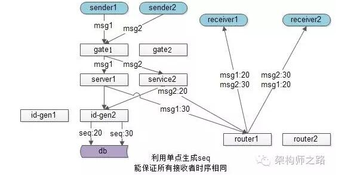
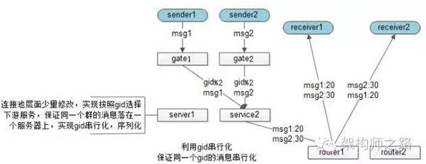

# 消息"時序"與"一致性"為何這麼難?
分布式系統中，很多業務場景都需要考慮西洨投遞的時序，如
1. 單聊消息投遞保證發送發發送順序與接收方展現順序一致
2. 群聊消息投遞，保證所有接收方展現順序一致
3. 充值支付消息，保證同一個用戶發起的請求在服務端執行序列一致

## 為什麼時序難以保證，消息一致性難?
1. 時鐘不一致
> 分布式環境下，有多個客戶端、有web集群、service集群、db集群，都分佈在不同機器。機器都是使用本地時鐘，而沒有所謂的"全局時鐘"來完全決定消息的時序
2. 多客戶端(發送方)，假設只有一個接收方
> 即使是一台服務器的本地時間，也會因為網路延遲無法保證"絕對時序"上的傳達消息
3. 服務集群(多接收方)，假設只有一個發送方
> 多發送方程序內部可能是異步處理，加上網路傳輸的不同步。不能保證"絕對時序"
4. 網路傳輸與多線程
> 發送方與多接收方都難以保證絕對時序

## 如何保證絕對時序
假設只有一個發送方，一個接收方。上下游只有一條連接池，通過非阻塞的方式通訊
> 可以，但是吞吐量會很低

## 優化方法
### 以客戶端或者服務端的時序為準
- 多客戶端、多服務端致使"時序"難以界定，需要一個標尺來衡量時序的先後順序。需要根據業務場景實作，例如
1. 郵件展示順序，其實是以客戶端發送時間為準
2. 秒殺活動時間判斷，肯定得以服務器的時間為準，不能讓客戶端修改本地時間。提前秒殺

### 服務端生成單調遞增的 id
- 可行，如 db 的 seq/ auto_inc_id ，但有可能導致性能瓶頸。且無法做擴展

### 大部分業務能接受誤差不大的趨勢遞增 id
- 消息發送、帖子發佈時間、甚至秒殺時間都沒有太過精準的時序要求:
1. 同 1s 內發佈的聊天訊息時序亂了
2. 同 1s 內發佈的帖子排序不對
3. 用 1s 內發起的秒殺，由於服務器多台之間時間有誤差，落到 A 服務器的秒殺成功了，落到 B 服務器的秒殺還沒開始，業務上也是可以接受的(用戶感知不到)

> 大部分業務，長時間趨勢遞增的時序就能滿足業務需求，不需要分布式的遞增 ID

### 利用單點序列化，保證多機相同時序
數據為了保證高可用，需要做到進行數據冗余，同一份數據儲存在多個地方。如何保證數據的修改消息一致，就需要"單點序列化"
1. 在一台機器上序列化操作
2. 再將操作序列分發到所有的機器，保證多機的操作序列是醫治的，最終數據是一致的

- [場景一] 數據庫主從同步
數據酷得主從架構，上游分別發起 op1, op2, op3 三個操作，主庫 master 來序列化所有的 SQL 寫操作 op3, op1, op2
，然後把相同的序列發送給從庫 slave 執行，以保證所有數據庫數據的一致性，就是利用"單點序列化"這個思路

- [場景二] GFS中文件的一致性
GFS(Google File System)為了保證文件的可用性，一份文件要儲存多份，在多個上游對同一個文件進行寫操作時，
也是由一個主 chunk-server 先序列化寫操作，再將序列化後的操作發送給其他 chunk-server，來保證冗余文件的數據一致性

### 單對單聊天，怎麼確保發送順序與接收順序一致
單人聊天的需求，發送方 A 依次發出 msg1, msg2, msg3 三個消息給接收方 B，這三條消息能否保證顯示時序的一致性(發送與顯示的順序一致)?
1. 如果利用服務器單點序列化時序，可能出現服務端收到消息的時序為 msg3, msg1, msg2 與發出序列不一致
2. 業務上不需要全局一致，只需要對通一個發送方 A，他發送給 B 的消息時序一致就行，例如在發送消息時，加上 A 的發送時間
msg1{seq: 10, receiver: B, msg: content1}
msg2{seq: 20, receiver: B, msg: content2}
msg3{seq: 30, receiver: B, msg: content3}

> 潛在問題: 如果接收方 B 先收到 msg3，msg3 會先展現，後收到 msg1, msg2。要展現在 msg3 前面

### 群聊消息，怎麼確保各接收方收到順序一致
群聊消息的需求，有 N 個群友在一個群聊，怎麼保證所有人收到的消息顯示時序一致?
1. 不能再利用發送方的 seq 來保證時序，因為發送方非單點，時間也不一致
2. 可以利用服務器的單點做序列化

- 此群聊的發送流程為:
	1. sender1 發出 msg1，sender2 發出 msg2
	2. msg1 和 msg2 經過接入集群，服務集群
	3. service 層到底層拿一個唯一 seq，來確定接收方展示時序
	4. service 拿到 msg2 的 seq 是 20，msg1 的 seq 是 30
	5. 通過投遞服務發送消息給多個群友，群友即使收到 msg1 和 msg2 的時間不同，但可以統一按照 seq 來展現

這個方法能實現，所有群友的消息展示時序相同
> 缺點: 生成全局遞增序列號的服務容易成為瓶頸

- [改善]: 不保證全局消息序列有序，只要保證群內消息有序即可。這樣的話 `id串行化` 就成了一個很好的思路

這個方案中，service 層不需要在實踐一個管理 seq 的後端，而是在 service 連接池層面做一個小修改，
保證在一個群的消息落在同一個 service 上，這個 service 就可以用本地 seq 來序列化同一個群的所有消息，
保證所有群友看到消息的時序是相同的

# 總結
1. 分布式環境下，消息的有序性是很難的，原因很多: 時鐘不一致，多發送方，多接收方，多線程，網路傳輸不確定性 ... 等
2. 要"有序"，先得有衡量"有序"得標尺，可以是客戶端標尺，可能是服務端標尺
3. 大部分業務能接受`大範圍趨勢有序，小範圍誤差`;絕對有序的業務，可以借助服務器絕對時序的能力
4. 單點序列化，是一種常見的保證多幾時序統一的方法，典型場景有 db 主從一致， GFS 多文件一致
5. 單對單聊天，只需保證發出的時序與接收的時序一致，可以利用客戶端 seq
6. 群聊，只需保證所有接收方消息時序一致，需要利用服務端 seq，方法有兩種 `1. 單點絕對時序`、`2. ID 串行化`
