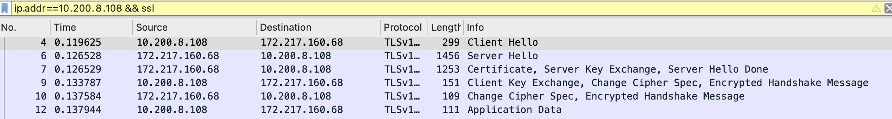

# intro
TLS的前身是SSL(Secure Sockets Layer)，由網景公司開發，後來被IETF標準化並改名

通常沒有特別說明時，SSL和TLS指的是同一個協議，不做嚴格區分

# 傳統TLS握手
在傳輸應用數據前，客戶端必須與服務端協商密鑰，加密演算法等信息。服務端還要把自己的證書發給客戶端表明其身份
```md
假設單次`TCP-handshake`需要費時`28ms`，那麼客戶需要等`168ms`之後才能開始發送`HTTP`請求。(假設以上動作不考慮client/server端，對於處理算法加解密時間)
> 光是TLS握手，就需要消耗兩個RTT(Round-Trip Time, 往返時間)，這就造成`HTTPS`更慢的主要原因。

當然，交換過後的TLS會以對稱加解密方式傳輸。開銷則沒有一開始連接那麼大。
```

# pcap解釋

1. 本地送`Client Hello`
2. `172.217.160.68`回傳`Server Hello`
3. `172.217.160.68`傳送`Server Hello Done`及`Certificate, Server Key Exchaange`
4. 本地送`Client Key Exchange, Change Cipher Spec, Encrypted Handshake Message`
5. `172.217.160.68`回傳`Change Cipher Spec, Encrypted Handshake Message`
6. 本地開始進行資料傳輸
> 詳細查閱 wireshark ./google_tls.pcap

# False Start
False Start有搶跑的意思，意味著不按規則行事。TLS False Start是指客戶端在發送`Change Cipher Spec Finished`同時發送應用數據(如HTTP請求)

服務端在`TLS`握手完成時直接返回應用數據(如HTTP響應)。這樣，硬玉數據的發送實際上並未等到握手全部完成，故謂之搶跑

> 啟用`False Start`之後，TLS階段只需要一次`RTT`就可以開始傳輸應用數據。`False Start`相當於客戶端提前發送加密後的應用數據，不需要修改TLS協議。目前大部分瀏覽器默認都會啟用，但也會有一些前提條件

1. 服務端必須在`Server Hello`握手中通過`NPN(Next Protocol Negotiation)`，下一代協議協商，Google在SPDY協議中開發的`TLS擴展`，庸握手階段協商應用協議或`ALPN(Application Layer Protocol Negotiation,應用層協議協商，NAN的匡發修訂版)表明自己支持的HTTP協議，如: http/1.1, http/2;

2. 使用支持前向安全性(Forward Secrecy)的加密算法。`False Start`在尚未完成握手時就發送了應用數據，`Forward Secrecy`可以提高安全性

# Certificate
TLS的身分證是通過證書信任鏈完成的，瀏覽器從站點證書開始遞歸校驗父證書，直至出現信任的根證書(根證書列表一般內置於操作系統，Firefox自己維護)。站點證書是在`TLS`握手階段，由服務端發送

# Certificate-Chain
配置服務端證書鏈時，有兩點需要注意
1. 證書是在握手期間發送的，由於TCP初始擁塞窗口的存在，如果證書太長可能會產生額外的往返開銷
2. 如果證書沒包含中間證書，大部分瀏覽器可以正常工作，但會戰婈驗正並根據子證書指定的父證書URL自己獲取中間證書
(這個過程會產生額外的DNS解析、建立TCP連結等開銷，非常影響性能)

# ECC Certificate
如果需要進一步減小證書大小，可以選擇ECC(Elliptic Curve Cryptography, 橢圓曲線密碼學)證書。256位的ECC Key等同於3072位的RSA Key，在確保安全性的同時，體積大幅減小


# refer:
- TLS握手優化解
> https://imququ.com/post/optimize-tls-handshake.html#toc-4
- testing tools for RFC5077
> https://github.com/vincentbernat/rfc5077
- 認識 PKI 架構下的數位憑證格式與憑證格式轉換的心得分享 分享
> https://blog.miniasp.com/post/2018/04/21/PKI-Digital-Certificate-Format-Convertion-Notes
