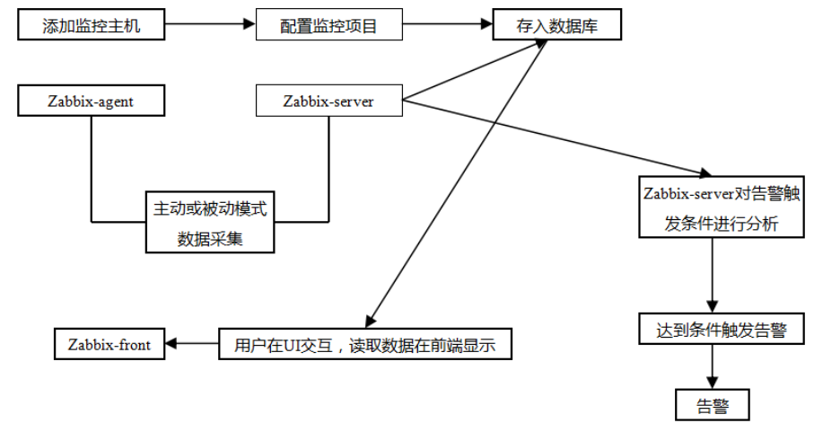

# intro

使用 zabbix 收集資料，並於 grafana 顯示資料

# quick-start
1. docker-compose up -d
2. http://127.0.0.1
3. 預設 帳號/密碼: admin/zabbix

# 架構
)

# refer:
- https://github.com/zabbix/zabbix-docker
- https://github.com/fivestrong/zabbix-grafana-docker
- https://www.ichiayi.com/wiki/tech/zabbix
- https://www.itread01.com/content/1566469258.html
- https://kknews.cc/zh-tw/code/e94v5n.html
